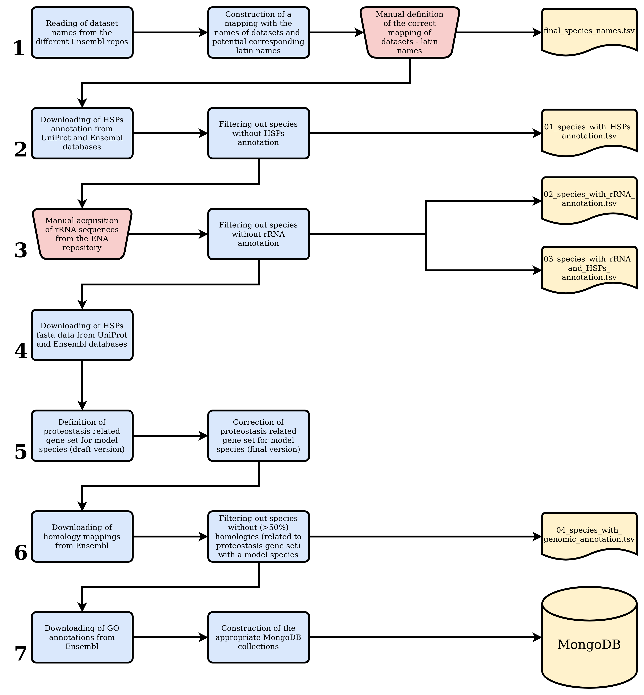

## Code to Generate the Data For Eukaryotes

#### 1. Aims:

1. Find the set of eukaryotic species that have adequate annotation of proteostasis-related genes and annotated sequences of heat shock proteins (40kDa, 70kDA) and ribosomal sequences.

2. Collect all these data in appropriate formats to perform the main analysis

#### 2. Important files

In the folder 'files' there are some important data (in tsv format), which have been created manually and they are used in order to complete the data acquisition.

1. [Proteostasis related gene sets](./files/initial_table_evol_proteostasis_manual_curation.csv): It contains manually defined lists of genes for some model species (i.e _Homo sapiens_, _Arabidopsis thaliana_) and a generic list for prokaryotes. That file is used to generate the respective gene lists for other eukaryotes, based on their genomic homologies with the model species.

2. [Ensembl parameters](./files/ensembl_parameters.tsv): It inludes necessary arguments to connect in the different repositories of the [Ensembl](https://www.ensembl.org/index.html) ([plants](http://plants.ensembl.org/index.html),  [fungi](http://fungi.ensembl.org/index.html), [metazoa](http://metazoa.ensembl.org/index.html) and [verterbates](http://www.ensembl.org/index.html)) and retrieve data for HSPs, homologies and genomic annotation. That tab-delimited data is loaded in all the R scripts in order to get access in the aforementioned repos.

3. [Model species](./files/model_species.tsv): As the whole workflow of data acquisition is based on some specific model species, that static file contains all the necessary information about these and their corresponding datasets in the Ensembl. Similarly to the file of parameters, it is used in many different steps of that workflow.

#### 2. Short description: 

