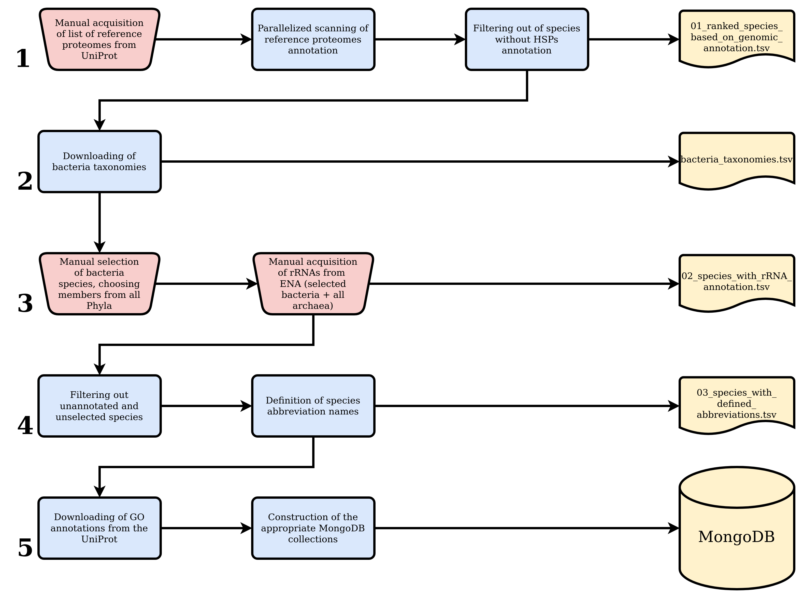

## Code to Generate the Data For Prokaryotes

 
 

#### 1. Important Notes:

- The main goal here is to define the list of species from the kingdom of Archaea and Bacteria, that will be included in the analysis. All the selected species should have annotated HSP40 (DNAJ), HSP70 (DNAK) and ribosomal RNA sequences. All the tasks, except from a search for bacteria taxonomic classification, are performed for both kingdoms. In general, The process is simpler than that of eukaryotes' dataset.

- The list of reference proteomes for [Bacteria](./bacteria/preprocessing/reference_proteomes.tab) and [Archaea](./arhaea/preprocessing/reference_proteomes.tab) should be downloaded from the UniProt database, manually. Only the these species will be considered to find them, which fulfil the requirements for HSPs and rRNA sequences annotation.

- Initially species without CPD equal to 'Standard' are filtered out.

- HSPs annotation is retrieved from UniProt programmatially. Then, species without adequate data are filtered out and all the others are recorder in 01_ranked_species_based_on_genomic_annotation.tsv.

- As Bacteria which deliver the above requirements are thousands and their amount should be attenuated, their taxonomic classification is retrieved (Phylum and Class level) in order to select representative species from all the taxonomic clades. In case of Archaea, the process continues without that extra step.

- For the selected Bacteria and all the Archaea, ribosomal rRNA sequences are downloading from the ENA repository manually. The process is completed with the generation of 02_species_with_rRNA_annotation.tsv.

- Species without rRNA data are filtered out and the names and abbreviations of the final species set is written in 03_species_with_defined_abbreviations.tsv.

- Finally, GO annotations are downloaded from UniProt and an appropriate MongoDB collection is created for each species.

 
 

#### 2. Short description: 

